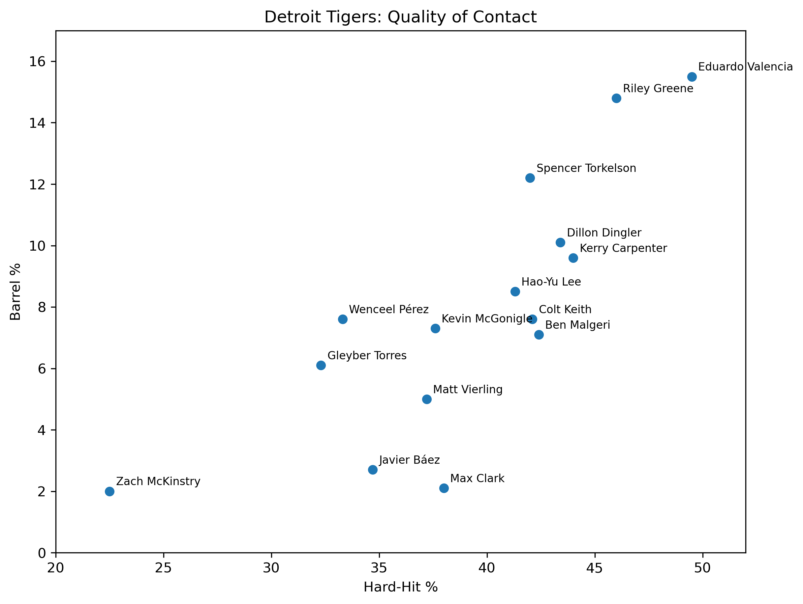
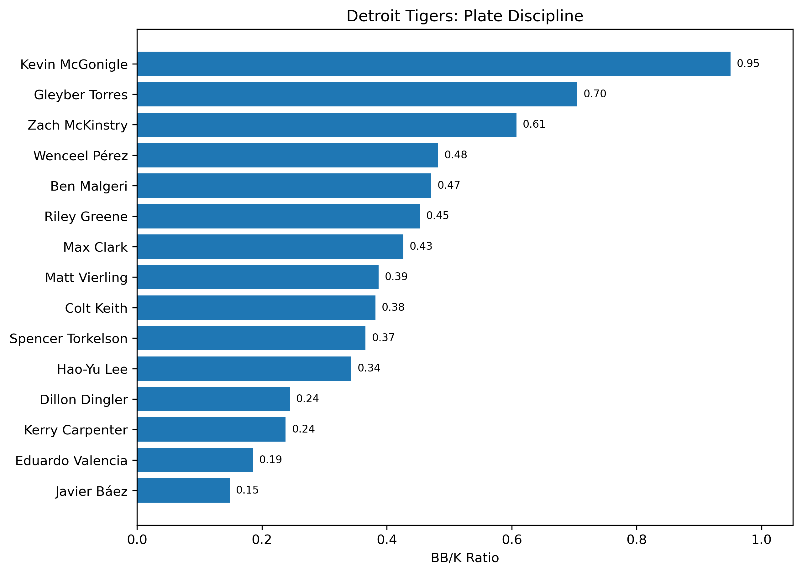
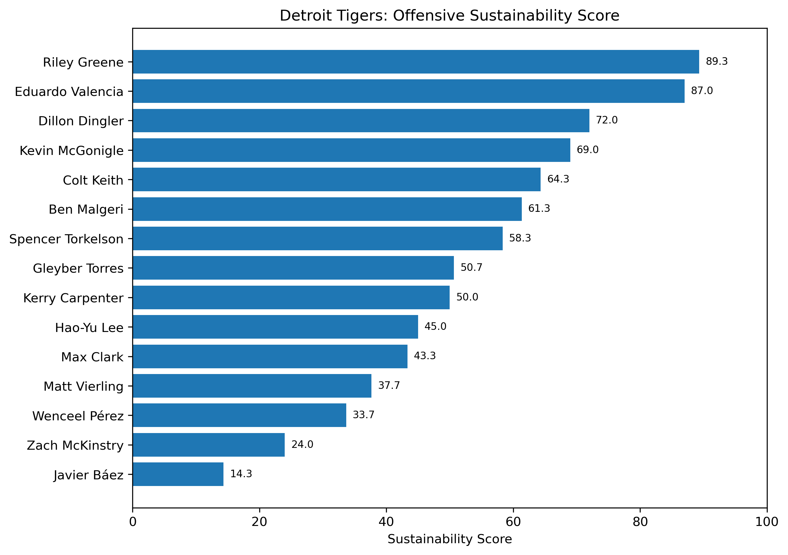

# Detroit Tigers Hitter Analysis 2026

A baseball analytics project evaluating Detroit Tigers hitters using Statcast expected metrics, quality-of-contact indicators, and plate-discipline measures.

## Research Question

**Which Detroit Tigers hitters show the strongest underlying offensive profiles, and whose actual results differ most from expected performance?**

## Project Overview

This project compares traditional offensive production with Statcast expected statistics to identify:

- hitters with strong underlying offensive profiles
- players who may have underperformed their expected results
- players whose actual production exceeded expected metrics
- differences in quality of contact
- differences in plate discipline

The main analysis includes Detroit Tigers hitters with **100+ plate appearances**.

---

## Data

The analysis uses 2026 Detroit Tigers hitting data from **Baseball Savant / Statcast**.

Metrics included:

- AVG
- OBP
- SLG
- OPS
- HR
- BB%
- K%
- Exit Velocity
- Hard-Hit %
- Barrel %
- wOBA
- xwOBA
- xBA
- xSLG

---

## Actual vs. Expected Offensive Performance

.png)

This scatterplot compares actual **wOBA** with **xwOBA**.

The diagonal reference line represents:

`wOBA = xwOBA`

- Above the line = expected production was higher than actual production
- Below the line = actual production exceeded expected production
- Near the line = actual and expected results were relatively similar

This comparison helps identify hitters whose underlying performance may not be fully reflected in their actual results.

---

## Quality of Contact



This chart compares **Hard-Hit %** with **Barrel %**.

Players toward the upper-right of the chart combine frequent hard contact with a higher percentage of barrels, indicating stronger quality-of-contact profiles.

---

## Plate Discipline



Plate discipline was evaluated using:

`BB/K Ratio = BB% ÷ K%`

Higher values generally indicate a stronger walk-to-strikeout profile.

Kevin McGonigle stood out in this analysis with the strongest BB/K Ratio among the selected hitters.

---

## Offensive Sustainability Score



To summarize several underlying offensive indicators, I created a custom **Offensive Sustainability Score**.

The score combines:

| Metric | Weight |
|---|---:|
| xwOBA | 40% |
| Hard-Hit % | 25% |
| Barrel % | 20% |
| BB/K Ratio | 15% |

Each metric was converted into a percentile rank within the selected Tigers sample.

The final score was calculated as:

```text
Sustainability Score =
100 × [
(xwOBA Percentile × 0.40)
+ (Hard-Hit Percentile × 0.25)
+ (Barrel Percentile × 0.20)
+ (BB/K Percentile × 0.15)
]
```

The Sustainability Score is a **project-specific evaluation metric**. It is not an official MLB statistic or predictive model.

---

## Expected Performance Gaps

Three additional metrics were calculated:

```text
xwOBA Gap = xwOBA - wOBA
xSLG Gap  = xSLG - SLG
AVG Gap   = xBA - AVG
```

Interpretation:

- Positive gap = expected results were stronger than actual results
- Negative gap = actual results exceeded expected results

Players were grouped into three performance categories:

| xwOBA Gap | Category |
|---|---|
| ≥ 0.025 | Underperforming Expected Results |
| ≤ -0.025 | Outperforming Expected Results |
| Between -0.025 and 0.025 | Results Match Expectations |

---

## Key Findings

### Riley Greene

Riley Greene ranked first in the Sustainability Score and showed the strongest overall combination of expected offensive production, quality of contact, and plate discipline within the selected Tigers sample.

### Eduardo Valencia

Eduardo Valencia ranked near the top of the Sustainability Score and produced some of the strongest contact-quality metrics in the dataset. However, his actual production exceeded his expected metrics by a notable margin, so his results should be interpreted with additional context.

### Matt Vierling

Matt Vierling showed the largest positive xwOBA gap in the analysis, meaning his expected offensive performance was stronger than his actual results.

This made him one of the clearest underperformance candidates in the dataset.

### Kevin McGonigle

Kevin McGonigle stood out for plate discipline and recorded the strongest BB/K Ratio among the hitters analyzed.

### Overall

Most Tigers hitters in the sample finished relatively close to their expected offensive performance, while a smaller group showed meaningful differences between actual and expected results.

---

## Methodology

The primary analysis includes hitters with at least **100 plate appearances**.

This threshold was used to reduce the influence of extremely small samples.

The project evaluates hitters across four primary areas:

1. **Actual offensive production**
2. **Expected offensive production**
3. **Quality of contact**
4. **Plate discipline**

Expected metrics were compared with actual results to identify possible overperformance and underperformance.

Percentile rankings were then used to place metrics with different scales onto a comparable basis before calculating the Sustainability Score.

---

## Limitations

This project has several limitations:

- Rankings are relative only to the selected Detroit Tigers hitters, not all MLB hitters.
- Players have different sample sizes.
- Smaller samples are less stable than full-season samples.
- Injuries and changes in playing time are not modeled.
- Park effects are not included.
- Opponent quality is not included.
- Platoon splits are not considered.
- Baserunning and defensive value are excluded.
- Expected statistics are descriptive estimates and are not guarantees of future performance.
- Sustainability Score weights were selected specifically for this project.

---

## Python Analysis

The analysis was recreated in Python using **pandas** and **matplotlib**.

The notebook includes:

- CSV data loading
- sample-size filtering
- percentage cleaning
- calculated expected-performance gaps
- BB/K Ratio
- performance classifications
- percentile rankings
- Sustainability Score calculation
- data visualization

View the full notebook here:

[Python Analysis Notebook](notebooks/tigers_hitter_analysis.ipynb)

---

## Tools Used

- Python
- pandas
- matplotlib
- Jupyter Notebook
- Microsoft Excel
- Baseball Savant / Statcast
- GitHub


---

## Conclusion

This project demonstrates how traditional statistics, Statcast expected metrics, quality-of-contact data, and plate-discipline indicators can be combined to create a more complete evaluation of hitter performance.

Within the selected Tigers sample, Riley Greene showed the strongest overall underlying offensive profile, while players such as Matt Vierling showed meaningful differences between actual and expected production.

The project also demonstrates an end-to-end analytics workflow using **Excel, Python, Jupyter Notebook, data visualization, and GitHub**.
