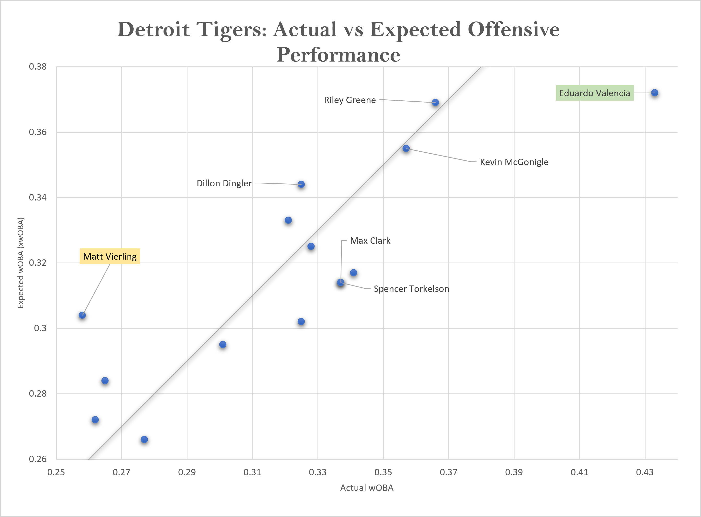
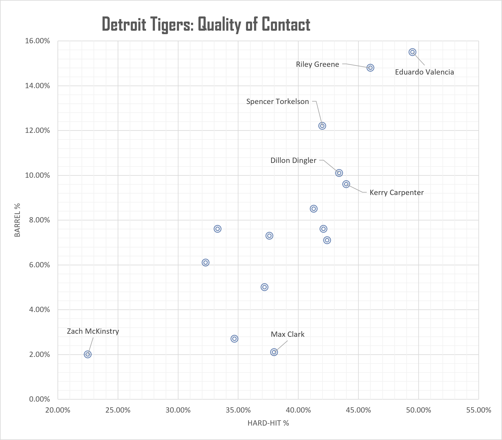
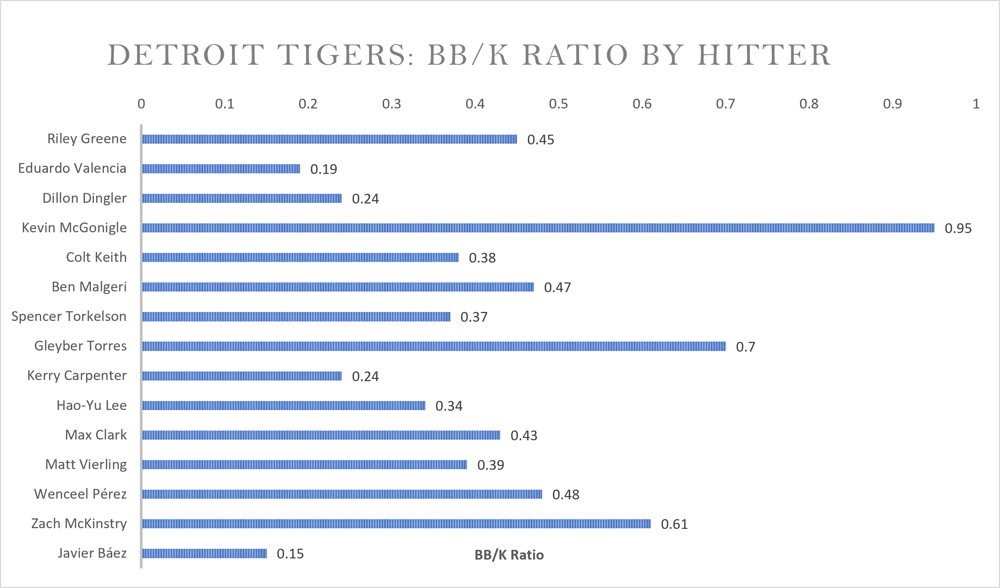
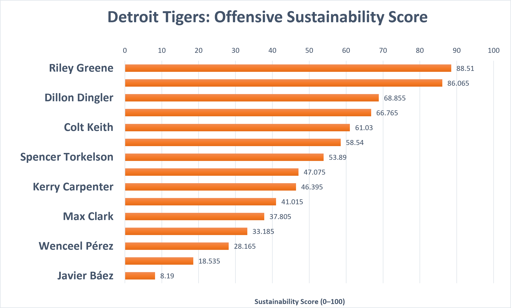

# Detroit Tigers Hitter Analysis

A baseball analytics project evaluating Detroit Tigers hitters using Statcast expected metrics, quality-of-contact indicators, and plate-discipline measures.

## Research Question

**Which Detroit Tigers hitters show the strongest underlying offensive profiles, and whose actual results differ most from expected performance?**

## Project Overview

This project compares traditional offensive production with Statcast expected statistics to identify:

- hitters with strong underlying offensive profiles
- players who may have underperformed their expected results
- players whose actual production exceeded their expected metrics
- differences in quality of contact and plate discipline

The main analysis includes Tigers hitters with **100+ plate appearances**.

---

## Dashboard

### Actual vs. Expected Offensive Performance



This chart compares **wOBA** with **xwOBA**.

- Above the reference line = expected production exceeded actual production
- Below the reference line = actual production exceeded expected production
- Near the line = results generally matched expectations

### Quality of Contact



Hard-Hit % and Barrel % are used to compare the quality and consistency of each hitter's contact.

### Plate Discipline



BB/K Ratio is used as a simple indicator of plate discipline.

### Offensive Sustainability Score



The Sustainability Score summarizes several underlying offensive indicators into one relative ranking.

---

## Key Findings

### Riley Greene
**Highest Sustainability Score: 88.5**

Greene showed the strongest overall combination of expected production, hard contact, barrel rate, and plate discipline within the selected Tigers sample.

### Eduardo Valencia
**Sustainability Score: 86.1**

Valencia produced some of the strongest quality-of-contact metrics in the dataset. However, his actual production exceeded his expected metrics by a significant margin, making his performance important to evaluate with additional context.

### Matt Vierling
**Largest positive xwOBA gap**

Vierling's expected offensive performance was substantially stronger than his actual results, making him the clearest underperformance candidate in the analysis.

### Kevin McGonigle
**Highest BB/K Ratio: 0.95**

McGonigle demonstrated the strongest walk-to-strikeout profile in the sample and stood out for plate discipline.

---

## Methodology

### Metrics

The analysis uses:

| Category | Metrics |
|---|---|
| Traditional Production | AVG, OBP, SLG, OPS, HR |
| Expected Performance | xBA, xSLG, xwOBA |
| Contact Quality | Exit Velocity, Hard-Hit %, Barrel % |
| Plate Discipline | BB%, K%, BB/K Ratio |

### Expected Performance Gaps

Three gap metrics were calculated:

```text
xwOBA Gap = xwOBA - wOBA
xSLG Gap  = xSLG - SLG
AVG Gap   = xBA - AVG
